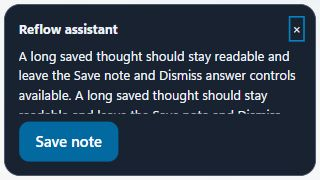

# Whole-codebase bug audit and installer verification

Date: 2026-10-03. Scope: the current working tree, including the feature expansion and existing uncommitted work. No commits, tags, hosted releases or model downloads were created by this audit.

The audit reviewed the React application and HUD, Rust session/runtime/storage/API paths, Android companion, Python runtime, and packaging/CI configuration. Three independent reviewers inspected storage/security, transport/Android, and UI/state behavior. A second pass challenged the fixes and found additional cancellation, authorization, retention and history races, which were also addressed. The user chose to continue with these reviews without an external model review.

This is evidence of the paths and cases checked, rather than a guarantee that every possible bug has been found. Physical devices, native focus/clipboard behavior and other operating systems have separate acceptance checks below.

## Confirmed findings and implemented fixes

| Area                       | Failure and resulting behavior                                                                                                                                                                                                                                                                                     | Verification                                                                        |
| -------------------------- | ------------------------------------------------------------------------------------------------------------------------------------------------------------------------------------------------------------------------------------------------------------------------------------------------------------------ | ----------------------------------------------------------------------------------- |
| Session completion         | “Scratch that”/“Undo that” returned before finishing the session, leaving Processing active. Commands now emit completion and reset ownership.                                                                                                                                                                     | `whole-codebase-session-red.log`, `whole-codebase-session-green.log`                |
| Cancellation cleanup       | An ASR cancellation error stranded the recording state. Ownership and Ready state now reset even when the engine reports an error.                                                                                                                                                                                 | `whole-codebase-cancel-red.log`, session GREEN                                      |
| Processing cancellation    | Desktop cancellation waited behind the processing lock and arrived after output. A per-session cancellation signal now drops the processing future and interrupts ASR before cleanup; stale owners cannot cancel a newer session.                                                                                  | `whole-codebase-processing-cancel-red.log`, session GREEN                           |
| Phone processing           | A socket could not consume Cancel/Close or shutdown/revocation while awaiting inference. Processing now selects against those events and releases the stop future before cancellation.                                                                                                                             | `whole-codebase-transport-evidence.log`                                             |
| Phone authorization        | Completion could expose private output after authorization changed, and desktop Stop did not carry phone authority. The session stores its owning token, checks authority before output/storage, and the socket checks authority again before returning completion.                                                | API controlled-ASR interruption/completion/desktop-stop regressions                 |
| LAN automation             | A retired LAN listener could inherit new localhost settings while closing and expose local automation. Authorization now uses the immutable bind scope of each listener.                                                                                                                                           | transport LAN RED/GREEN                                                             |
| Android injection          | Android checked `injected` although the desktop response contains `pasted`, treating failed pastes as success. The client now uses the actual response and reports the recovery state.                                                                                                                             | Android schema regression                                                           |
| Android recording          | Failed or timed-out recorder shutdown cleared ownership while its worker could still run. The lifecycle now retains/quarantines ownership until the worker actually releases.                                                                                                                                      | Android lifecycle regressions and full unit/build/lint run                          |
| Note preservation          | Transcript retention deleted explicit notes, and disabled history prevented saving voice notes. Automatic cleanup excludes notes; explicit note capture saves independently of transcript history. Manual deletion remains available.                                                                              | storage retention regressions, `whole-codebase-note-session-red.log`, session GREEN |
| File privacy               | File imports persisted transcripts/audio/subtitles while history was disabled. Imports now give enable-history guidance and recheck the current policy under the settings lock immediately before persistence.                                                                                                     | storage importer RED/GREEN                                                          |
| Recovery persistence       | Each restart opened a different recovery database, hiding earlier recovery writes. Recovery now reuses a stable database, or resumes the newest regular legacy recovery store when no stable store exists. Original and older recovery files remain untouched.                                                     | storage recovery restart regression                                                 |
| Privileged configuration   | Importing settings could activate an existing disabled command/file action. Imports now retain the whole local privileged mode and its activation selectors.                                                                                                                                                       | storage privileged-import regression                                                |
| Correction learning        | A very long word could trigger quadratic comparison work while holding settings. Tokens over 512 bytes are excluded from correction learning.                                                                                                                                                                      | storage correction limit regression                                                 |
| Subtitle consistency       | Editing/retrying an imported transcript left old SRT/VTT segments attached. Transcript updates invalidate segments transactionally; TXT remains available and subtitle export explains regeneration.                                                                                                               | storage edit/retry/export regressions                                               |
| Retention scheduling       | TTL cleanup only ran at startup/settings changes, and an older deferred cleanup could apply a superseded policy. The periodic worker applies the current policy; deferred cleanup reads it under `settings_operation` on a blocking worker. Session persistence also reads current storage policy under that lock. | retention scheduling RED/GREEN and storage compatibility                            |
| File import navigation     | Leaving Home unmounted import progress, cancellation and errors while the job continued. The controller now lives for the App lifetime, with visible errors after navigation.                                                                                                                                      | UI App/import regressions                                                           |
| Excluded applications      | The textarea removed a trailing newline on every keystroke, preventing a second entry. It now keeps an editable draft and normalizes on save/blur.                                                                                                                                                                 | UI control RED/GREEN                                                                |
| History deletion/filtering | A delayed deletion invalidated newer searches and decremented the wrong result total. Mutations refresh the current query instead.                                                                                                                                                                                 | UI history regressions                                                              |
| History editing            | An older save could close a newer editor or discard text typed while it was pending. Editor/draft epochs guard completion.                                                                                                                                                                                         | `whole-codebase-ui-history-races-final-green.log`                                   |
| History query ordering     | Older filter results could overwrite an edit/retry, including a result resolving in the same React batch. Mutation refresh invalidates the request synchronously before refetch.                                                                                                                                   | history races and batched RED/GREEN                                                 |
| Startup snapshots          | Delayed App/HUD state and model snapshots could overwrite newer events. Event generations and unmount guards preserve live state.                                                                                                                                                                                  | UI App and overlay RED/GREEN                                                        |
| Settings synchronization   | Settings events suppressed during a local save could be lost. Once the queue drains, the App reloads authoritative settings with event ordering guards.                                                                                                                                                            | UI App settings regression                                                          |
| Phone settings UI          | An older poll could restore a revoked device, old permissions or a rotated code. Poll results now carry mutation generations.                                                                                                                                                                                      | UI phone RED/GREEN                                                                  |
| Event subscriptions        | One intelligence listener failure prevented registering another. Registrations now fail independently and expose the failure.                                                                                                                                                                                      | UI hook regression                                                                  |
| Assistant HUD              | Long responses clipped action controls and the HUD could not receive keyboard dismissal. The text scrolls separately, Dismiss receives focus, and Escape works. The previous external window is retained as the next dictation target and restored on dismissal.                                                   | overlay focus RED/GREEN; browser geometry/scroll/focus/Escape check                 |
| Native model installer     | A detached download could publish stale status or restart a retired runtime after unload/switch. Per-install ownership gates protect writes/startup; status is isolated and unload/switch/drop invalidate pending work.                                                                                            | native installation RED/GREEN                                                       |
| Windows resource packaging | Parent-directory resources were bundled under `_up_`, but runtime discovery expected `model-runtime` beside the installed application. Explicit destination mappings now match discovery and keep language metadata beside the script.                                                                             | Node packaging regression; generated installer manifest and MSI extraction          |
| Test isolation             | Session tests wrote diagnostic reports to the normal app data directory. Context-owned report paths now keep fixture diagnostics in their temporary directory.                                                                                                                                                     | session fixture report-path assertion                                               |

The final cancellation pass also moved configured insertion delays into the asynchronous session pipeline and rechecked cancellation/phone permission at delivery, including undo delivery (`whole-codebase-insertion-delay-red.log`, session GREEN). Assistant focus is restored before recording admission so exclusions, modes and context inspect the external application; failed restoration prevents recording. Native focus behavior still needs physical acceptance.

The packaging fix follows [Tauri's documented resource destination mapping](https://v2.tauri.app/develop/resources/). README prerequisites now match Node 22 and Rust 1.88; release instructions match the gated macOS support and draft Windows/Linux release workflow. CI now runs all Python runtime/network-policy test files, rather than only one.

## Integrated validation

The integrated checks passed:

- Frontend: ESLint, Prettier, TypeScript and 177 tests across 37 files (`whole-codebase-frontend-final.log`). The production Vite build passed during packaging.
- Rust: 595 tests passed, with one existing opt-in hardware calibration test ignored (`whole-codebase-rust-final.log`). This included the installed Python ASR and llama-server integration tests. Rust formatting and all-target Clippy with warnings denied passed; the opt-in smoke executable was also checked separately.
- Python: 17 runtime/network-policy unit tests and 70 runtime self-tests passed. The MSI-extracted runtime also passed all 70 self-tests.
- Android: 30 unit tests, debug assembly and lint passed (`whole-codebase-transport-android-green.log`). Physical-phone behavior remains unverified.
- Packaging/process helpers: all 12 Node tests passed (`whole-codebase-packaging-tests-final.log`). Diff whitespace checks passed with Windows CRLF recognized.

Focused RED logs preserve actual reproduced failures; GREEN logs record the fixes. The transport evidence file distinguishes a passing precheck from the deterministic completion-boundary RED regression.

MSI administrative extraction succeeded into an isolated workspace folder. Each of the four runtime files matched its source SHA-256, and the extracted `reflow.exe --portable --help` exited successfully. This uses [Windows Installer administrative extraction](https://learn.microsoft.com/en-us/windows/win32/msi/administrative-installation), rather than installing into the user's normal application directory.

Extraction also exposed a 6.6 MB development smoke-test executable bundled by default. It now requires the `runtime-install-smoke` Cargo feature, excluding it from normal installers while retaining `cargo run --features runtime-install-smoke --bin runtime_install_smoke` for developers. The opt-in smoke run passed. Final MSI extraction confirmed that this executable is absent, the four runtime files match source, and the packaged executable runs successfully. Evidence: `whole-codebase-installer-verification-final.log`, `whole-codebase-msi-extract-final.log`, `whole-codebase-packaged-exe-help.log`, `whole-codebase-packaged-python-selftest.log` and `whole-codebase-runtime-install-smoke-final.log`.

Final unsigned Windows artifacts (both rebuilt from the fixes, with matching `.sha256` files):

| Artifact                                                                             | SHA-256                                                            |
| ------------------------------------------------------------------------------------ | ------------------------------------------------------------------ |
| [NSIS installer](../src-tauri/target/release/bundle/nsis/Reflow_0.2.0_x64-setup.exe) | `4647eb8dbc9016266c091e1b20eecc78fe856ce9267c3438510c5247909a8b0a` |
| [MSI installer](../src-tauri/target/release/bundle/msi/Reflow_0.2.0_x64_en-US.msi)   | `d7e9856c1b398ca3d37e6071422bb5a0204d981c95dcf66d84098d03ae702c67` |

The final packaging log is `whole-codebase-packaging-final.log`; its last rebuild reused the already verified production frontend via `--skip-frontend-build` after the Cargo-only smoke-tool exclusion. No application behavior changed after the 595-test Rust run. Signing, normal installation and hosted release publication were not performed.

Browser verification used a temporary fixture importing the actual AssistantAnswer component and production styles. The 312 × 172 content area scrolls long text, keeps Save note inside the HUD, focuses Dismiss, and handles Escape. No assistant proposal was executed during this check.

## Remaining acceptance work

- Clean-machine Windows install, upgrade, uninstall and first-run checks; signing with project credentials. Local builds and administrative extraction do not establish those behaviors.
- Real microphone/loopback captures, Android device recording and disconnects, native clipboard/focus and assistant-to-dictation behavior, volume restoration, battery transitions and OS keyring behavior.
- Network-disconnected desktop flows and Python dependency availability on a clean machine. The installer contains scripts/metadata/requirements, not a Python interpreter, its packages or speech models.
- Linux/Wayland and macOS native acceptance. Hosted CI must run in its own environments; macOS installer publication stays gated.
- Native experimental ASR recognition/accuracy qualification and the existing opt-in hardware calibration test. Optional diarization remains intentionally omitted under the feature specification.

These are unverified release/hardware acceptance tasks. All confirmed findings above are implementation work handled by this audit; unknown bugs can still exist outside the exercised cases.
